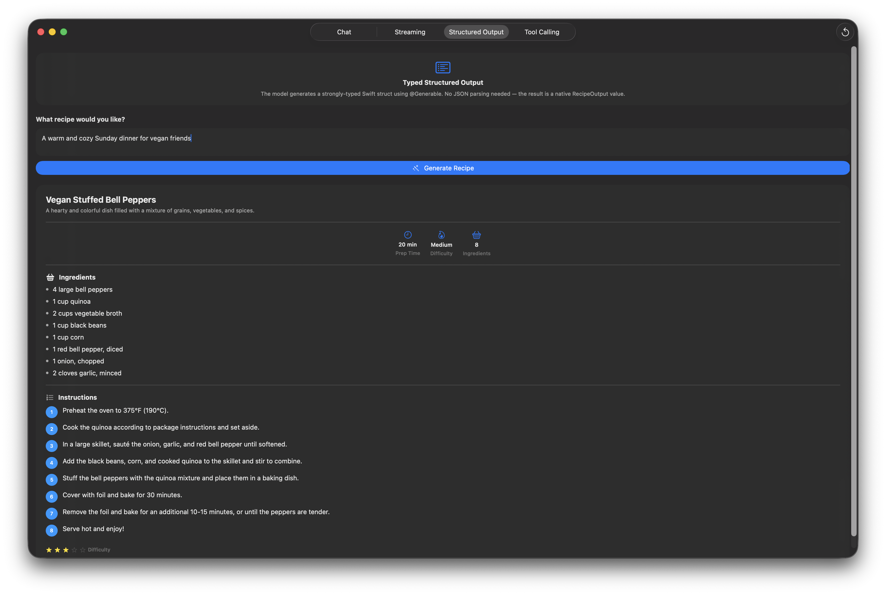

> **This repository has been archived.** Development continues in [moonexpr/monogarden](https://github.com/moonexpr/monogarden) at `app/apple-intelligence-demo/`.

# Apple Intelligence Demo

A SwiftUI app demonstrating the `FoundationModels` framework (Apple's on-device LLM, iOS 26+). Built as a developer showcase and learning reference.



## Requirements

- Xcode 26 beta
- iOS 26+ device or simulator
- Apple Intelligence enabled (or simulator scheme set to "Simulated Foundation Models Availability: available")

## Architecture

Tab-based SwiftUI app — one tab per `FoundationModels` feature.

```
AppleIntelligenceDemo/
├── AppleIntelligenceDemoApp.swift     — @main entry point
├── MainTabView.swift                  — TabView root
├── AvailabilityGateView.swift         — SystemLanguageModel availability check
├── ChatView.swift                     — Multi-turn LanguageModelSession
├── StreamingView.swift                — streamResponse() with live token display
├── StructuredOutputView.swift         — @Generable + @Guide constraints
└── ToolCallingView.swift              — Tool protocol implementation
```

## Features

| Tab | API Feature |
|-----|-------------|
| Availability | `SystemLanguageModel.default.availability` — gates the rest of the app |
| Chat | `LanguageModelSession` with system prompt; multi-turn conversation |
| Streaming | `session.streamResponse()` — token-by-token display with cancel support |
| Structured Output | `@Generable` struct + `@Guide` constraints (`.count`, `.range`, `.anyOf`) |
| Tool Calling | `Tool` protocol — model decides when to invoke a mocked weather tool |

## Key API Patterns

```swift
// Basic response
let session = LanguageModelSession()
let response = try await session.respond(to: prompt)

// System prompt (builder pattern)
let session = LanguageModelSession {
    "You are a helpful cooking assistant."
}

// Streaming
let stream = session.streamResponse() { prompt }
for try await partial in stream { text = partial.content }

// Structured output
@Generable struct Recipe {
    @Guide(description: "Name of the dish") var name: String
    @Guide(.count(3)) var ingredients: [String]
    @Guide(.range(1...5)) var difficulty: Int
}
let recipe = try await session.respond(generating: Recipe.self) { prompt }

// Tool calling
final class WeatherTool: Tool {
    let name = "getWeather"
    let description = "Returns current weather for a city"
    @Generable struct Arguments {
        @Guide(description: "City name") let city: String
    }
    func call(arguments: Arguments) async throws -> String { ... }
}
```

## Running

1. Open `AppleIntelligenceDemo.xcodeproj` in Xcode 26
2. Select an iOS 26 simulator or device
3. If using simulator, set the scheme's "Simulated Foundation Models Availability" to `.available`
4. Build and run — tap each tab and press **Generate** to exercise the API
